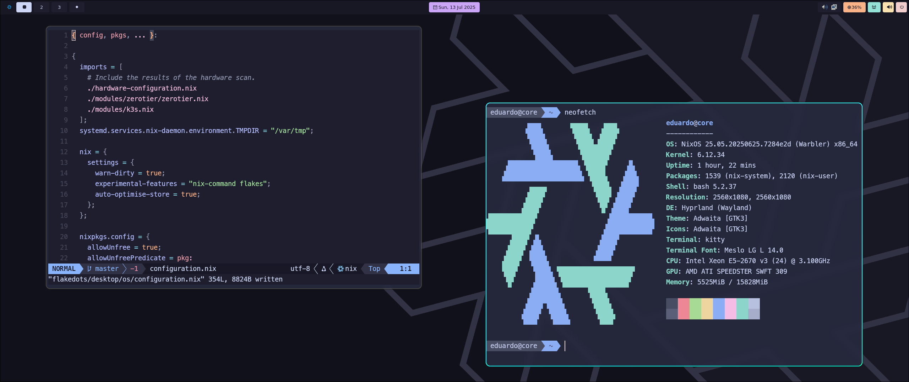

# 🐧 NixOS & Home Manager Configuration
[](https://nixos.org)
[](https://nix-community.github.io/home-manager/)
[](https://neovim.io)

<p align="center">
  
</p>

---
This repository contains my personal configurations for **NixOS** and **Home Manager**, tailored for both desktop and laptop environments. It also includes shared Neovim settings.

### 🧩 Configured Software

This setup comes with several pre-configured tools for a minimal and efficient Linux experience:

* **Hyprland Suite**:

  * `hyprland` – dynamic Wayland compositor
  * `hyprlock` – screen locker
  * `hyprpaper` – wallpaper daemon
  * `hyprschot` – screenshot utility
* **Kitty** – fast, GPU-based terminal emulator
* **Neovim** – configured with plugins and LSP support
* **Wofi** – application launcher
* **Dunst** – notification daemon
* **Zsh** – shell with plugins and themes
* **Others** – fonts, themes, media tools, system utilities...

Everything is managed declaratively via Home Manager.

---
## ⚙️ Usage

### 🖥️ Desktop

```bash
# Rebuild full system with flake
sudo nixos-rebuild --flake .#desktop

# Build and activate only Home Manager
nix build .#hmConfig.desktop.activationPackage
./result/activate
````

### 💻 Laptop

```bash
# Rebuild full system with flake
sudo nixos-rebuild --flake .#laptop

# Build and activate only Home Manager
nix build .#hmConfig.laptop.activationPackage
./result/activate
```


